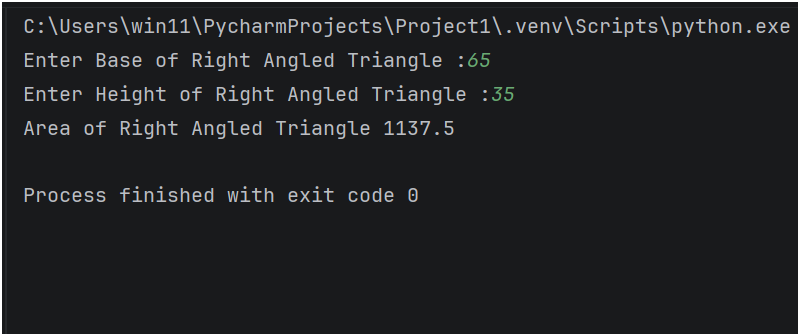

## Python Practice Question – Area of a Right-Angled Triangle

This folder contains a Python program that solves a **basic practice question** using input, output, and arithmetic operations.

It is intended for beginners to strengthen their understanding of **core Python fundamentals** through simple problem-solving.

---

## 📌 Program Overview

The program in this folder covers the following practice question:

- Calculate the **area of a right-angled triangle** based on its base and height.

The program takes user input from the console and displays the result clearly.

---

## 🧪 Code Functionality

The program demonstrates:

### Arithmetic Operations
- Multiplication (`*`)

### Mathematical Formulas
- Area of a right-angled triangle: Area = 0.5 * base * height

### Input Handling
- Accepting floating-point input (`float()`) for the base and height
- Performing calculations using user-provided values

The program is written in a **simple and readable format**.

---

## 🖥️ Output

The program prints the calculated area directly to the console after taking user input.  
The complete console output for this practice question is shown below.

---

## 📂 File Information

- `AreaOfRightAngledTriangle.py` — Contains the practice question program  
- `Output.png` — Screenshot of console output  
- `README.md` — Folder documentation  

---
## 👨‍💻 Author

**MD Shahnawaz Noor**     
*Aspiring Data Scientist* 
   
GitHub: [https://github.com/shahnawaznoor2020-code](https://github.com/shahnawaznoor2020-code)             
Email: shahnawaznoor2020@gmaIl.com  
 
---

## ⭐ Note

These practice programs help build a strong foundation in Python.  
They are essential before moving to conditions, loops, and advanced logic.
